Problem Statement and Solution
One of the biggest problems companies face is to track employee expense while the employee is on bussiness trip or related activity.
Hence there is a need for a platform that can track all these expense and also include multiple people in a bussiness who can see
and take some action on those expense claims.

So, as a solution to the problem we built the Expense Approval system for a bussiness. This project is built using React, Express.js, MongoDB, Node.js. Here React is used to build the frontend and Express.js with Node.js for the backend with a MongoDB database in connection. In the frontend part redux toolkit is used to manage state globally and to make RTK queries to the backend. Authentication system using JWT tokens is built into EAS.There are multiple users with different functionalities and expenses will go through multiple levels of approval.

The user types and their functions are:

common to all users:

- register with some restrictions
- login and logout
- view profile
- pagination and search
- toast notifications
- loader

Employee:

- add new expenses which will be forwareded to HR of company
- see history of expenses
- delete expenses upto certain point in process
- view status of the expense
- Multi file and type upload

HR:

- approve employee expenses forwarding it to Director
- see and download expense reports of projects or a date range
- reject expense with a reason
- see history
- check expense status

Director:

- approve employee expenses forwarding it to Finance Department
- see and download expense reports of projects or a date range
- reject expense with a reason
- see history
- check expense status

Finance Department:

- reimburse employee expenses
- see and download expense reports of projects or a date range
- reject expense with a reason
- see history
- check expense status
- add amount to user account as advance to bussiness activity expense

Admin:

- add,edit and delete users
- add, edit and delete projects
- see and download expense reports of projects or a date range

Note: Empty uploads folder should be added in project root folder for local file upload to work.

Below are some of the images that demonstrate the features of the Expense Approval System:

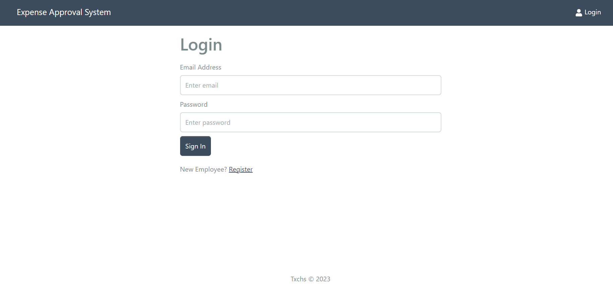
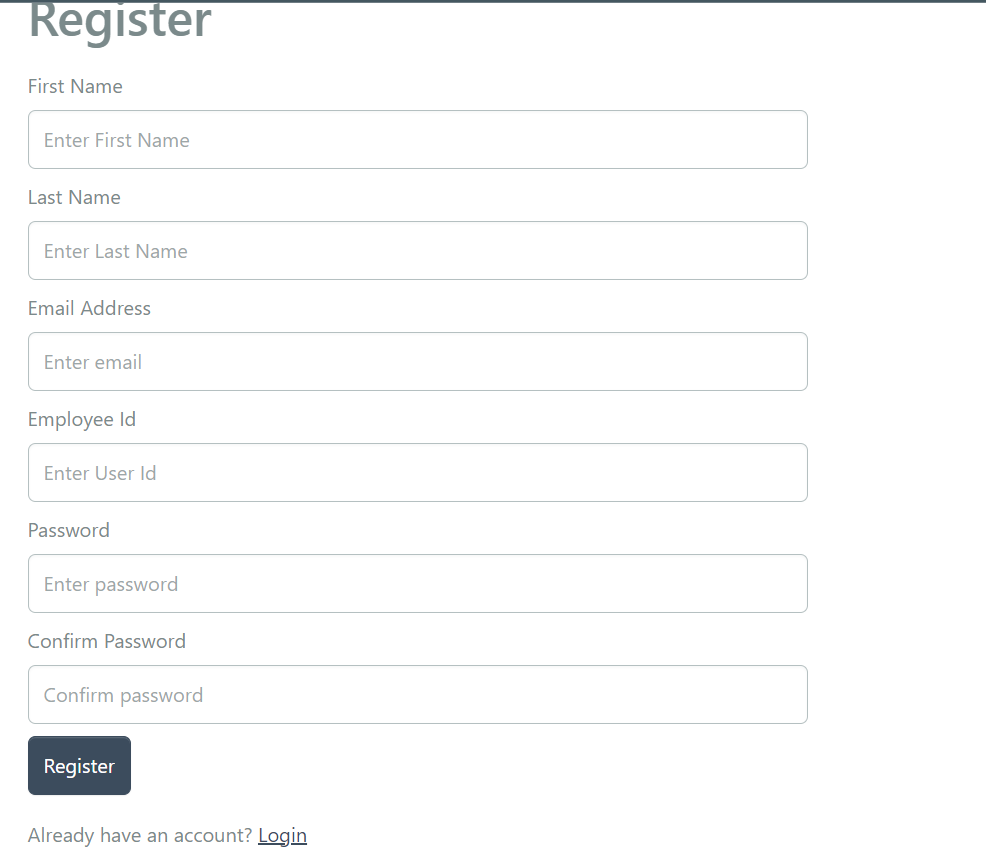
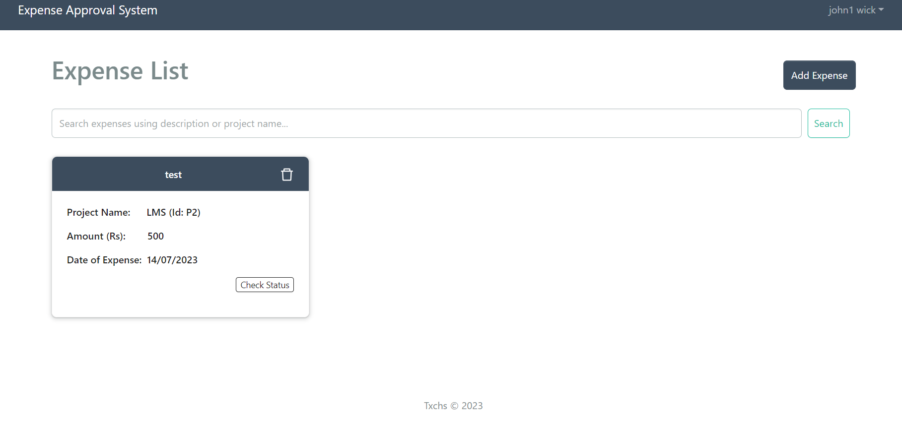
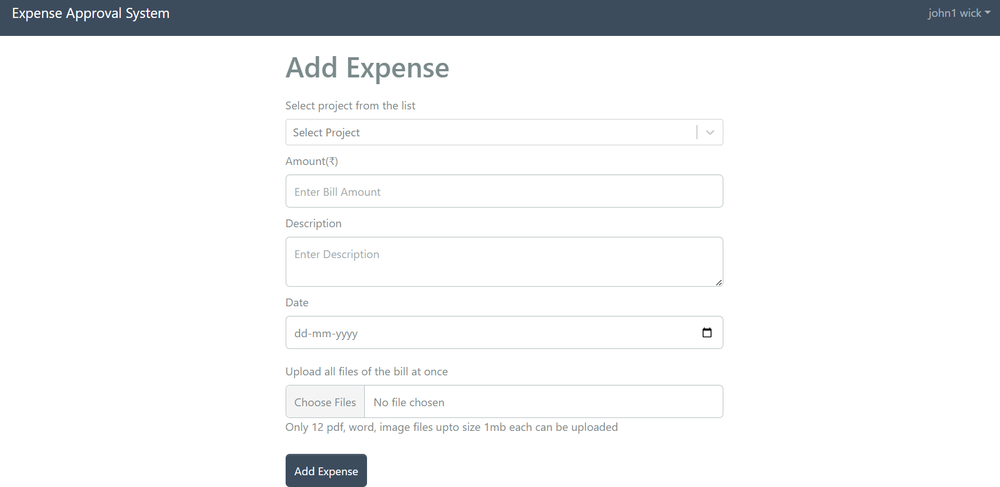
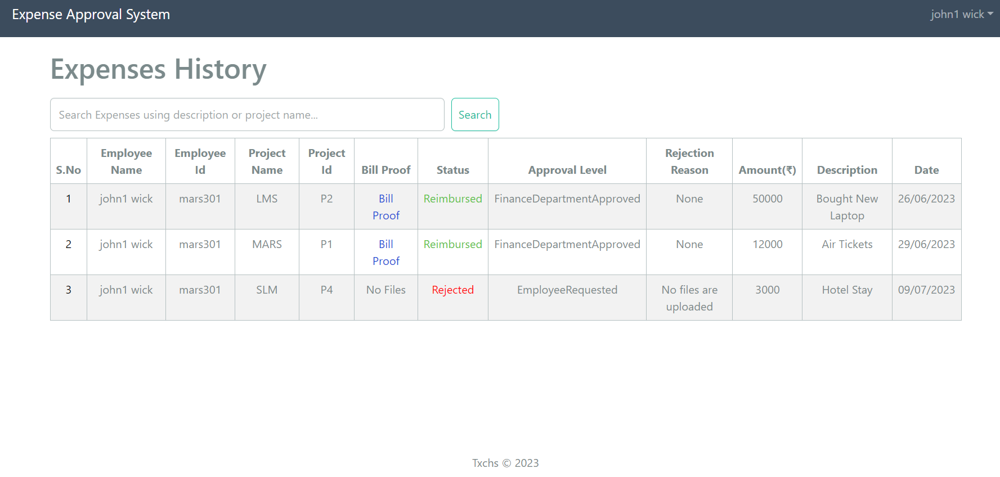
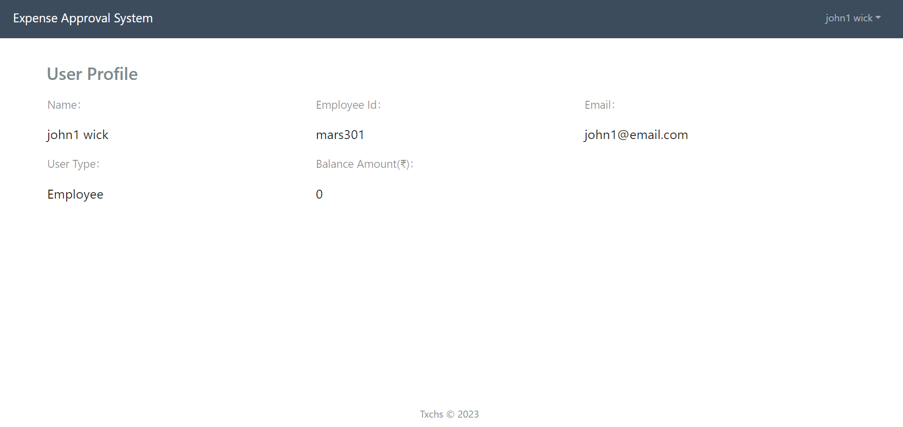
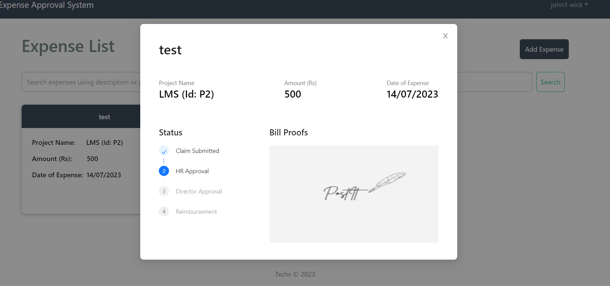
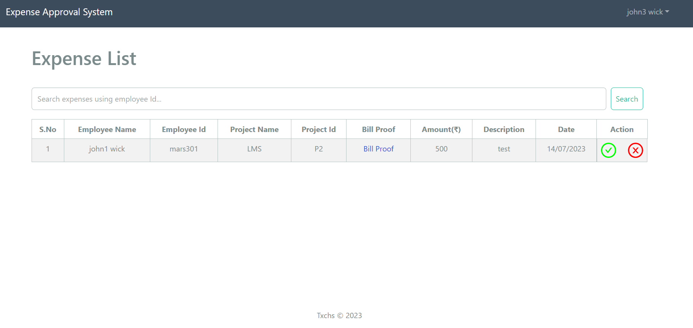
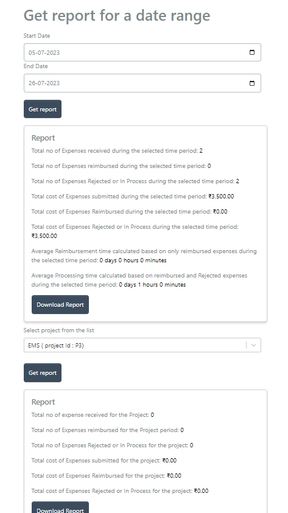
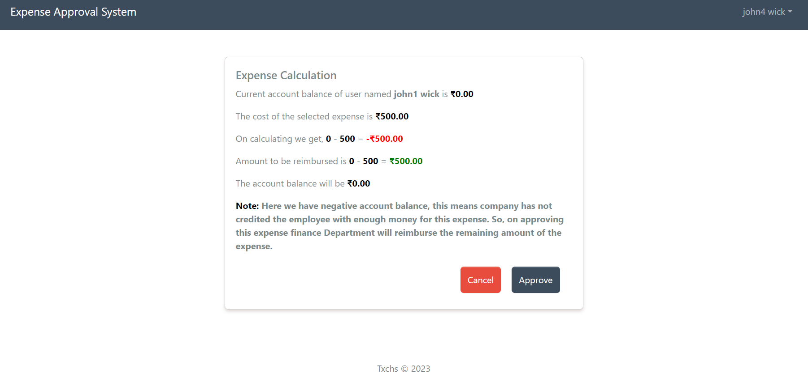
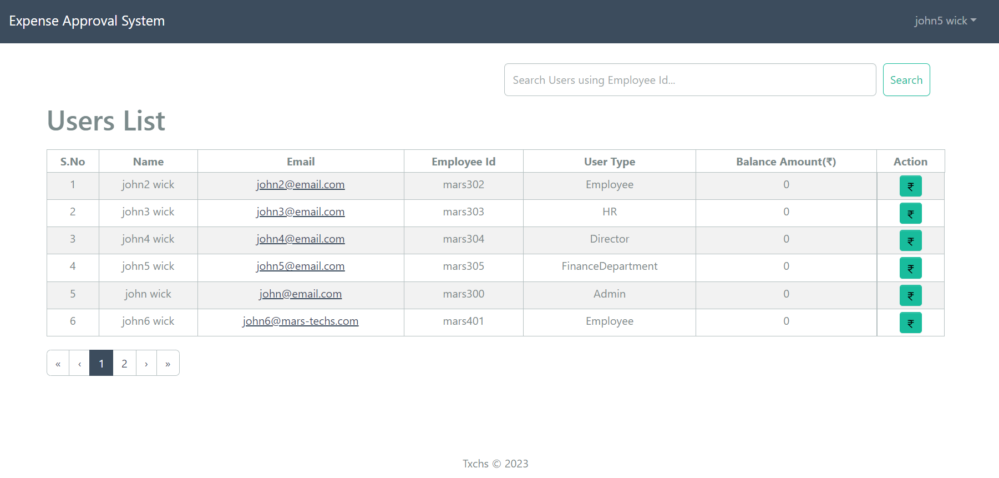
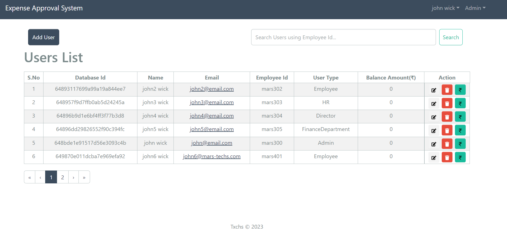
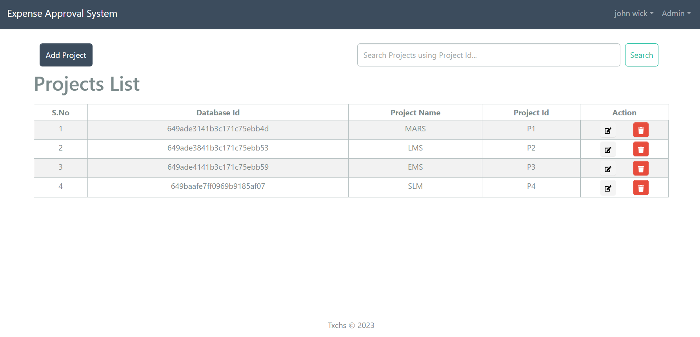
